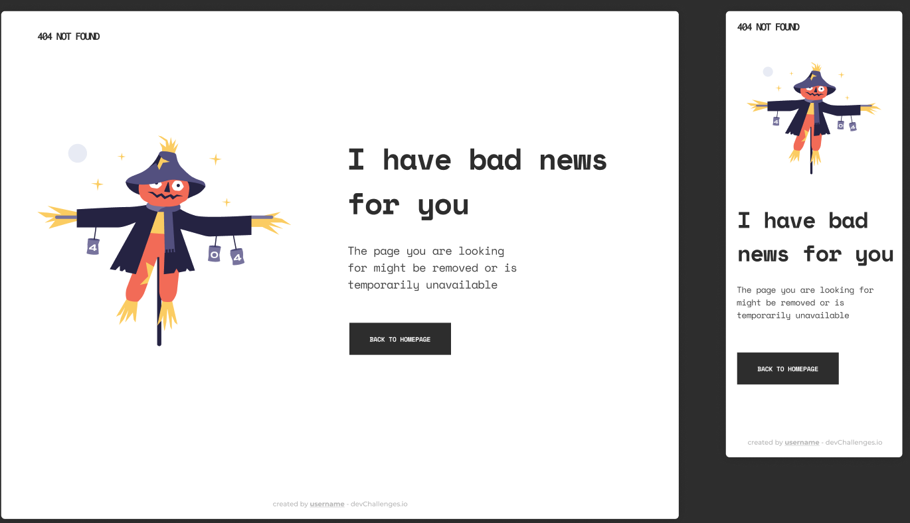
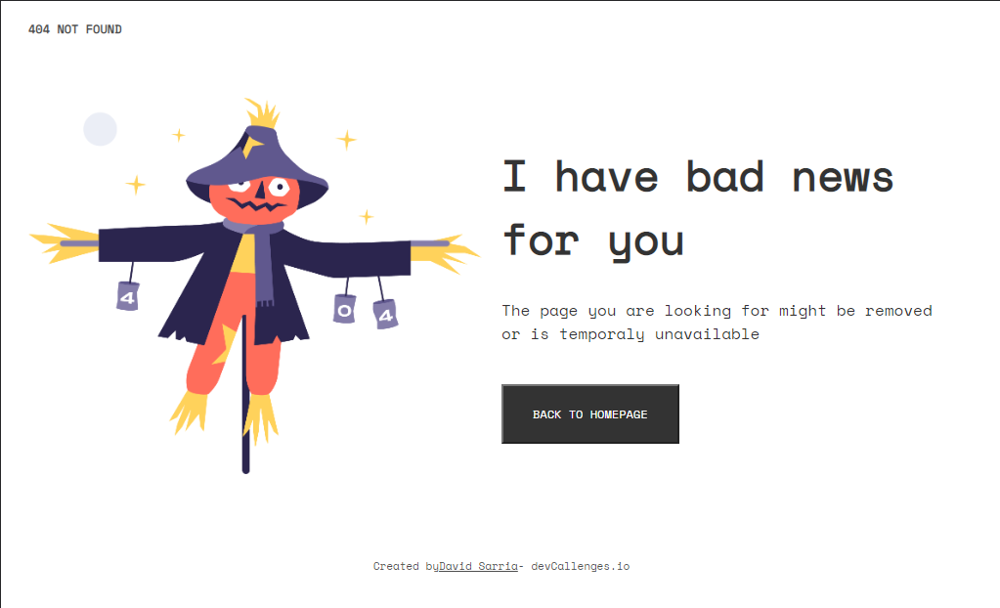
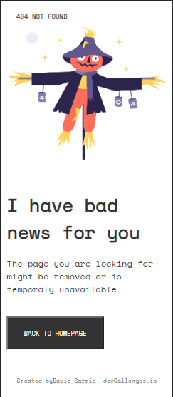

# Davidenco - 404 PAGE NOT FOOUND

This is a solution to the mission number 1 - HTML - project of the Make It Real course.

## Overview

### The challenge

I have to build a 404 resposive web page and it looks like to the desing bellow. The user should be able to see the best desing according to the screen size on their devices.



## My process

### Built with

- Semantic HTML5 markup
- CSS custom properties
- Flexbox
- Mobile-first workflow

### What I learned

The main topic that I learned in this challenge was "FLEXBOX", it's difficult for me when I have diferents areas that they need Flexbox propeties, however, I can finish the challenge with some things to improve.

### Step by step

- Build the structure HTML: I used semantic HTML5 markup with three global sections, header, main and footer.

```html
<body>
    <header>
        <p>404 NOT FOUND</p>
    </header>
    <main>
        <div id="img-container">
            
        </div>
        <div id="information-container">
            <h1>I have bad news for you</h1>
            <p>The page you are looking for might be removed or is temporaly unavailable</p>
            <button>
                BACK TO HOMEPAGE
            </button>
        </div>    
    </main>
    <footer>        
        Created by <a href="#"> David Sarria </a> - devCallenges.io
    </footer>
</body>
```
- Create CSS sheet aside: I created a file aside for the CSS styles, you can see the script in the repository.

- Validate my responsive desing: Bellow, yo can see the final desing.

### Screenshot Mobile



### Screenshot Desktop


